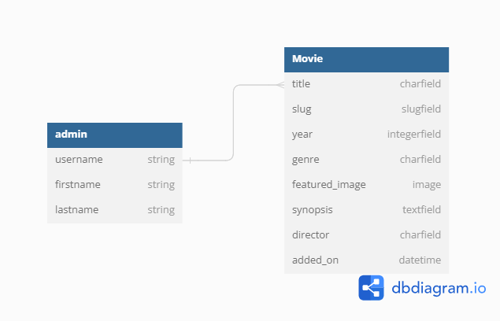
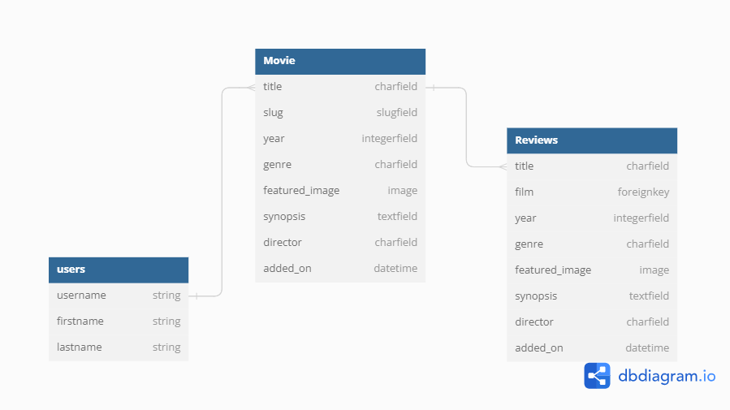
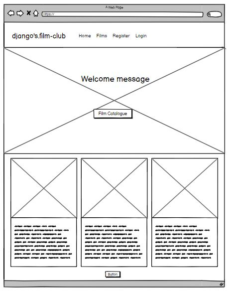
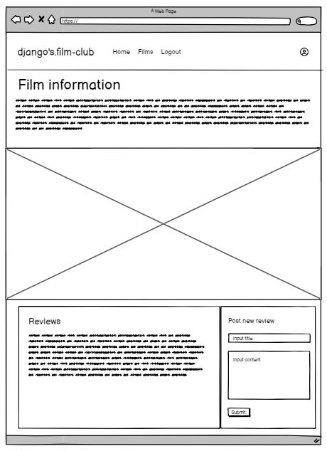

# django's.film-club

## Introduction

django's.film-club is a film review website for film lovers. The aim of the website is to create a space for movie lovers to share the opinions and express their love for the cinema with other film lovers.

Films will forever be a visual medium for humans to tell stories, the role of the admin on the website will be to post film subjects where users will be able to post their reviews under the film subject. New film subjects should be posted weekly by the admin to keep the website relevant and users visiting on a frequent basis.

[Visit the Website Here](https://djangos-film-club-532a7f9d2300.herokuapp.com/)

## UX - User Experience
* Strategy Plane
* Scope Plane
* Structure Plane
* Skeleton Plane
* Surface Plane

## Strategy Plane
A plan is needed to ensure the purpose of the website meets the needs of site users, the audience and the site owner.

### Target Audience
The target audience can be wide for movie watchers but as this is a digital review platform the audience will have to be competant in using technology but also interested in spending time on movie review forums.

* 18 - 35 year olds
* Film enthusiasts.

### User Stories

#### Catalogue of film subjects - Should have
* As a user, I can view a catalog of film subjects so that I can see past film subjects and view the reviews from other users.

#### Post a review on a film - Must have
* As a user I can type up a review on a film so that I can submit the review on the site for other user's to read.

#### Add films to a genre category - Could have
* As an admin, I can add films to a genre so that users can see the genre a film belongs to as part of the details of a film.

#### Register and login to review and add comments - Must have
* As a visitor, I can register so that I can leave a review on a film and comment on reviews.

#### Delete reviews - Must have
* As a user, I can delete my reviews to remove unwanted reviews.

#### Edit reviews - Must have
- As a user, I can edit my reviews so that I can amend what I have written.

#### Add film to review - Must have
* As an admin, I can add a film subject so that site visitors can see the upcoming film to watch and add reviews.

## Scope Plane
I identified 2 main pages were needed for the website to be able to functon as required;

Film Details page
* A page for each film where a films details can be viewed.
* Reviews can be viewed on the film on the page.
* Only logged in users can leave reviews.

Add new film page
* A page where an admin can only access to add new films.

For the site to fucntion well and a good user experience, the other pages needed were;
* Homepage - This page can contain the catalogus of films
* Login/ register page

## Structure Plane
For the website to be able to fulfill its basic goal to post weekly film subject for users to review, there are 2 models and applications that the site will feed off;
* Movies
* Reviews

### Movies
Only an admin will be able to post films which will contain details of film, this is espacially for those who have not seen the film and this will give them some information before they watch it;

### Reviews
Only an admin will be able to post films which will contain details of film, this is espacially for those who have not seen the film and this will give them some information before they watch it;

## Skeleton Plane
I have created wireframes of 3 pages (homepage, film_details and post_film) to design the layout of the pages.

### Home page
A user will be introduced to the website with a hero image and a welcome messsage. Below the hero image will be the film listings that have been posted and new films will appear here. The 'film catalogue' button on the hero image will take the user to the bottom of the page. The button at the bottom of the page will appear if there are more than 3 films so users can navigate.

The nav bar on the homepage wireframe is what it will look like for a user that has not logged in. The homepage and logo will always take the user to the homepage, the 'films' link will take a user to the bottom to the catalogue. The links to register and login will give users the option to create an account or login if the user has an account already.

### Film Details
The page will hold film information and image. Below this will display the reviews that have been posted by users of the film and beside there will be a form which can be filled for users to leave their own reviews. Only logged in users can leave a review.

The nav is what will look like for a logged in user, the option for logout is present instead of 'login' and 'register'.

### Post Film
This page will only be available for an admin user. This can be seen on the navbar the 'Posts' link only appears for admins.

This page is where a new film can be added by filling out the form. This page will also contain a list of films on the website, delete and edit buttons can be added here for admins to either delete or edit the entries.

## Surface Plane
### Colour theme
The site has light and dark colours, dark borders and light in the centre.

As this is a review website and the activity on the website is reading, it is easier to read dark text on light background. To seperate sections and border page, dark colour was used for simple seperation and to highlight sections when needed.

Shades of blue and yellow have been used as the primary colours for the website - Trust is represented in the colour blue and yellow.

Red has been used to highlight information as a small ribbon that may get lost on the site. This makes the information stand out and gives a good contrast against the white, blue and yellow.

* Navy blue #181c31
* Light blue ##ebefff
* Yellow #ffad60;
* Red #ff004c

### Type
Only 3 different font have been used;
* Paytone One
* Hind Madurai
* Playwrite NZ

Paytone has been used for the logo and the welcome, the font is bold, has a touch of flair and looks soft so gives the website a feeling of playfulness.

The text font is Hind Madurai has been used as main body of the font - looks it looks very standard but slightly different to other standard fonts.

The tagline is Playwrite NZ - the tagline needed to standout and is quote from the film 'Django Unchained'.

## Features

### Navbar
The options on the navbar will appear differently depending on whether a user is logged in, an admin logged in and logged out.

The navbar will also show the log in status on the right of the nav.

#### Not logged in
When a user is not logged in the nav will give the option to the user to register an account or log in to an existing account. The 'film' link take the user to the film section of the homepage for easy navigation if a user is not on the homepage.

#### User login
When a user is logged in the user will have the options to navigate to Home, the films section on home or logout.

#### Admin login
On admin login, the admin will have the option to access the Posts page where films can be added, edited or deleted on the catalogue.

### Footer
The footer has the name of the website and underneath that would be social media links to the sites socials.

### Homepage
#### Banner
A user will be met with the hero image, taglne and welcome message. There is a button as an anchor tag which directs a user to the film section to the bottom of the page in case a user does not know how to navigate to the film catalogue.

#### Catalogue
This section will list films in order of date added for user to select which they want to click into for a more detailed view, find reviews or post their own reviews. The section will list 3 films at a time and will paginate if there are more than 3.

### Film details
#### Film
When a film's title and synopsis is clicked on, this take the user to the film's details page. This expands contains the detail of the film, includes the director of the film.

#### Reviews
Below the film image is the section for reviews which is split into reviews that have been posted by users on the left where visitors can read these, they appear in the order of latest and it lists down. On the right is where a logged in user can post their own reviews. They would need to fill the title of their review and the content. If a user is not logged in they will not be able to leave a review on the website.

#### Edit and delete reviews
Users will be able to edit or delete only their own reviews, these buttons will appear on their reviews.

### Post films
This page is only accessible to admin users. The function of the page is the ability for admin to add films to the catalogue for users to be able to add reviews under.

#### Add a film
This section contains the form fields needed to add a film. If an image is not uploaded, a placeholder image will be supplied on the site until this is updated by the admin. The same title is not able to submitted on the site to avoid duplication of films being posted.

#### Film Catalogue
The catalogue of films will appear on the right of the form which contain the edit and delete button under each film. The edit will populate the form with the films detail for admin to change information if they wish.

### Login/ Register
#### Login
The login page requires the user to fill their username and password to be able to login, if a user does not have an existing account there is a link to the 'register' page. 

#### Register
To register to the site is quite simple, the user will need to create a username and password, the email is optional to provide. The password has a few simple requirements, if they are nor met an error is notifed.

#### Logout
The function of logout page is to allow users to logout of the sign and the page confirms this with the user.

## Testing

## Bugs and Fixes
### Post form
#### Year field – need to add restrictions
* Year can have less and more than 4 figures
this now fixed by adding a min value of 1000 and max value of 9999 in forms.py

### Title field – Invalid input of duplicate titles - fixed
* Duplicate titles causes page error
Now fixed to not allow addition of films with an existing title.

* Lowercase titles in post film causes error - Same slug key causes error in post film if a new submission is posted in a different case to existing title entry.
- This has now been fixed. The slugfield in model creates a unique slug id on submission and the title field in form is case insensitive if the title already exists.

### Currently field 
* This field appears under the Image if a error is notified - fixed by adding the class in css to 'display:none;' as theire that appears with the field in html.

### Time
* The times that are being recorded next to each post is 1 hour behind. This has now been fixed by adding GB in the settings timezone.

## Lessons Learned
Not enough user stories