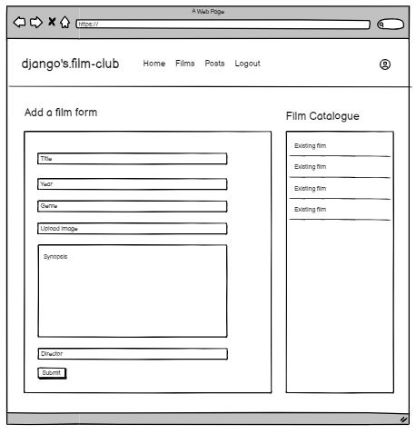
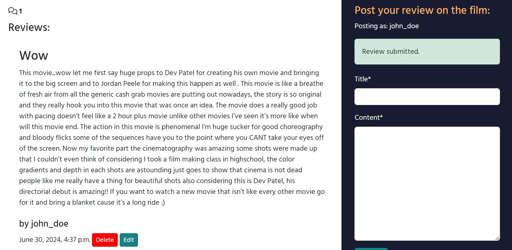

# django's.film-club

## Introduction

django's.film-club is a film review website for film lovers. The aim of the website is to create a space for movie lovers to share the opinions and express their love for the cinema with other film lovers.

Films will forever be a visual medium for humans to tell stories, the role of the admin on the website will be to post film subjects where users will be able to post their reviews under the film subject. New film subjects should be posted weekly by the admin to keep the website relevant and users visiting on a frequent basis.

[Visit the Website Here](https://djangos-film-club-532a7f9d2300.herokuapp.com/)

## UX - User Experience
* Strategy Plane
* Scope Plane
* Structure Plane
* Skeleton Plane
* Surface Plane

## Strategy Plane
A plan is needed to ensure the purpose of the website meets the needs of site users, the audience and the site owner.

### Target Audience
The target audience can be wide for movie watchers but as this is a digital review platform the audience will have to be competant in using technology but also interested in spending time on movie review forums.

* 18 - 35 year olds
* Film enthusiasts.

### User Stories

[Link to User Stories](https://github.com/users/StringerMus/projects/5/views/1)

#### Catalogue of film subjects - Should have
* As a user, I can view a catalog of film subjects so that I can see past film subjects and view the reviews from other users.

#### Post a review on a film - Must have
* As a user I can type up a review on a film so that I can submit the review on the site for other user's to read.

#### Add films to a genre category - Could have
* As an admin, I can add films to a genre so that users can see the genre a film belongs to as part of the details of a film.

#### Register and login to review and add comments - Must have
* As a visitor, I can register so that I can leave a review on a film and comment on reviews.

#### Delete reviews - Must have
* As a user, I can delete my reviews to remove unwanted reviews.

#### Edit reviews - Must have
- As a user, I can edit my reviews so that I can amend what I have written.

#### Add film to review - Must have
* As an admin, I can add a film subject so that site visitors can see the upcoming film to watch and add reviews.

#### Comment on a review - Could have
* As a user I can comment on review's posted on a film so that I can share my opinion on a review.

#### Rate films - Could have
* As a user, I can leave a film rating so that I can reflect my opinion of the film.

#### Like comments and review - Could have
* As a user I can like 'like' comments and reviews so that I can interact with posts on the site to show my opinion.

#### Edit comments - Could have
* As a user, I can edit my comments so that I can amend what I have written.

#### Delete Comments - Could have
* As a user, I can delete my comment so that I remove my unwanted comments from the site.

## Scope Plane
I identified 2 main pages were needed for the website to be able to functon as required;

Film Details page
* A page for each film where a films details can be viewed.
* Reviews can be viewed on the film on the page.
* Only logged in users can leave reviews.

Add new film page
* A page where an admin can only access to add new films.

For the site to fucntion well and a good user experience, the other pages needed were;
* Homepage - This page can contain the catalogus of films
* Login/ register page

## Structure Plane
For the website to be able to fulfill its basic goal to post weekly film subject for users to review, there are 2 models and applications that the site will feed off;
* Movies
* Reviews

### Movies
Only an admin will be able to post films which will contain details of film, this is espacially for those who have not seen the film and this will give them some information before they watch it;

### Reviews
Only an admin will be able to post films which will contain details of film, this is espacially for those who have not seen the film and this will give them some information before they watch it;

## Skeleton Plane
I have created wireframes of 3 pages (homepage, film_details and post_film) to design the layout of the pages.

### Home page
A user will be introduced to the website with a hero image and a welcome messsage. Below the hero image will be the film listings that have been posted and new films will appear here. The 'film catalogue' button on the hero image will take the user to the bottom of the page. The button at the bottom of the page will appear if there are more than 3 films so users can navigate.

The nav bar on the homepage wireframe is what it will look like for a user that has not logged in. The homepage and logo will always take the user to the homepage, the 'films' link will take a user to the bottom to the catalogue. The links to register and login will give users the option to create an account or login if the user has an account already.

### Film Details
The page will hold film information and image. Below this will display the reviews that have been posted by users of the film and beside there will be a form which can be filled for users to leave their own reviews. Only logged in users can leave a review.

The nav is what will look like for a logged in user, the option for logout is present instead of 'login' and 'register'.

### Post Film
This page will only be available for an admin user. This can be seen on the navbar the 'Posts' link only appears for admins.

This page is where a new film can be added by filling out the form. This page will also contain a list of films on the website, delete and edit buttons can be added here for admins to either delete or edit the entries.

## Surface Plane
### Colour theme
The site has light and dark colours, dark borders and light in the centre.

As this is a review website and the activity on the website is reading, it is easier to read dark text on light background. To seperate sections and border page, dark colour was used for simple seperation and to highlight sections when needed.

Shades of blue and yellow have been used as the primary colours for the website - Trust is represented in the colour blue and yellow.

Red has been used to highlight information as a small ribbon that may get lost on the site. This makes the information stand out and gives a good contrast against the white, blue and yellow.

* Navy blue #181c31
* Light blue ##ebefff
* Yellow #ffad60;
* Red #ff004c

### Type
Only 3 different font have been used;
* Paytone One
* Hind Madurai
* Playwrite NZ

Paytone has been used for the logo and the welcome, the font is bold, has a touch of flair and looks soft so gives the website a feeling of playfulness.

The text font is Hind Madurai has been used as main body of the font - looks it looks very standard but slightly different to other standard fonts.

The tagline is Playwrite NZ - the tagline needed to standout and is quote from the film 'Django Unchained'.

## Features

### Navbar
The options on the navbar will appear differently depending on whether a user is logged in, an admin logged in and logged out.

The navbar will also show the log in status on the right of the nav.

#### Not logged in
When a user is not logged in the nav will give the option to the user to register an account or log in to an existing account. The 'film' link take the user to the film section of the homepage for easy navigation if a user is not on the homepage.

#### User login
When a user is logged in the user will have the options to navigate to Home, the films section on home or logout.

#### Admin login
On admin login, the admin will have the option to access the Posts page where films can be added, edited or deleted on the catalogue.

### Footer
The footer has the name of the website and underneath that would be social media links to the sites socials.

### Homepage
#### Banner
A user is met with the hero image, taglne and welcome message. There is a button as an anchor tag which directs the user to the film section at the bottom of the page in case a user does not know how to navigate to the film catalogue.

#### Catalogue
This section lists films in order of date added for user to select which they want to click into for a more detailed view, find reviews or post their own reviews. The catalogue section lists 3 films at a time and paginates if there are more than 3 and further pages are create if more than 3 films exceeds a page.

The films loaded are a mix from JSON file with added date provided and some posts added from the website.

### Film details
#### Film
When a film's title and synopsis is clicked on home page's catalogue section, this takes the user to the film's details page. This expands the details of a film, including the director of the film.

#### Reviews
Below the film image is the section for reviews which is split into reviews that have been posted by users on the left where visitors can read these, they appear in the order of latest and it lists down. On the right is where a logged in user can post their own reviews. They would need to fill the title of their review and the content. If a user is not logged in they will not be able to leave a review on the website.

#### Edit and delete reviews
Users are able to edit or delete only their own reviews, these buttons will appear on their reviews.

### Post films
The page is only accessible to admin users. Here the admin can add films to the catalogue for users to be able to add reviews under.

#### Add a film
This section contains the form fields needed to add a film. If an image is not uploaded, a placeholder image is supplied on the site until this is updated by the admin.

#### Film Catalogue
The catalogue of films appear on the right of the form which contain the edit and delete button under each film. The edit populates the form with the films detail for admin to change information if they wish.

### Login/ Register
#### Login
The login page requires the user to fill their username and password to be able to login, if a user does not have an existing account there is a link to the 'register' page. 

#### Register
To register to the site is quite simple, the user will need to create a username and password, the email is optional to provide. The password has a few simple requirements, if they are nor met an error is notifed.

#### Logout
The function of logout page is to allow users to logout of the sign and the page confirms this with the user.

#### Responsiveness
The website has been developed to bit for the following screen sizes;
* 320px
* 768px
* 1024px
* 1400px

## Testing
### Automated Testing
There are automated testing that have been completed for the reviews and films.

#### Reviews
##### Forms
The test checks if forms functions correctly if input fields have been input correctly and if fields are missing. The tests pass ok.

##### Views
This checks if the page renderes correctly, the field I have been unable to test is the image field but I will conduct manual test on this. The tests pass ok.

#### Films
##### Forms
Same test as the reviews forms, checks if form will accept a form submission if entered correctly and incorrectly. The tests pass ok.

### Manual Testing

#### User Story Testing
[Link to User Stories](https://github.com/users/StringerMus/projects/5/views/1)

##### Register and login
As a user when I visit the site the navbar pn the right tells me I am not logged in. I have the option to either register or login.

When I click on 'Register' this takes me to the 'Register' page, I need to fill in the form: create a username, email(optional), password and confirm the password. If I already have an account there is a link to the login page, when I click on the link, this takes me to the Login page.

I am unable to create an account with a username that already exists, the password cannot be similar to the username, must have atleast 8 characters and can't fully numbers.

I fill out the form with a test account; username: john_doe
After submitting the form successfully I am signed in as john_doe, a notification tells me at the top of the screen and on the nav bar.

I can log out by navigating to the 'logout' page on the nav bar, the sites confirms that I do want to log out.

To log back in I click the log on link in the nav bar, this takes me to the login page. I fill out the form with the username and password I used to create the account an log back in.

#### Catalogue of film subjects
On the homepage hero image there is button in red 'Film Catalogue' and the the link at the top of the page 'Films' which takes the user to the bottom of the homepage where the catalogue exists for a user to be able to click into a film to visit the film's page, expand its details, view reviews on the film and a user can post reviews on the film here.

#### Post a review on a film
If I click into a film the film_details page loads for the film. I can see the films information(title, genre, year, sysnopsis and image, I can see the slug in the url).

I have clicked into the 'Monkey Man' film, underneath the films details there are no reviews as none have been posted. There is a review form next to the review section for me to type my own reviews. I fill this form out, I used existing reviews I have found on Google reviews as example to test the function.

I submit the review, the page reloads with a notification the review has been submitted and the review appears with the title, content, author, date & time.

To test the review form, views, edit and delete functionality properly, I have clicked into 'The Wailing' film where 2 reviews already exist. As john_doe I will post another review.
When I submit the review, this is added to the review section and as this is ordered on latest the review appears at the top. The review count also increases from 2 to 3 as the number of reviews increases.

The edit and delete buttons appear only next to the review I have posted as 'john_doe'. I am unable to edit reviews from the other users.

#### Edit & delete reviews
When I click the edit button this populates the review form with the title and content for the user to update. I can update the content to anything I want and hit the update button. This refreshes the page with the entries updated with what I have typed and a notification is provided the review has been updated.

To delete the review I simply hit the delete button, this prompts the delete modal to appear for the user to confirm deletion as the review will be deleted permenantly. Once confirmed this deletes the review, a notification is shown and the review no longer exists.

#### Add film to a review
To add a film, the Posts page will need to be accessed, only an admin can access this page. To test the page I have logged in as an admin and accessed the page.

I can see the film form on the left side of the page and the catalogue of films listed on the right with edit and delete buttons.

As an admin I fill in the form with a new films detail, I have not selected an image for this film post as a placeholder image should be provided until the admin supplies the film with an image.

I submit the film, a notification is provided the film has been added and the film now appears on the catalogue list. The film also appears on the homepage under the films section and I can click into it to add and view reviews.

To test if images for films can be uploaded, I made another film entry for 'Batman', the image appears on the homepage and when I click into the film's detail page.

#### Add films to a genre category
There is a dropdown in the film form to select the genre for the film which is submitted and part of the film's detail.

#### Edit & delete films
If I click the edit button, the film form populates with the film's details and I can update any detail of the film.
I can edit 'Batman' film details to a another film 'There will be blood'. The 'Batman' film's details have changed to the There Will be Blood in the catalogue section, homepage and the film's details page.

To delete a film entry I can delete a film by clicking the delete button underneath a film in the posts page. This brings up the delete confirmation modal. After clicking yes this deletes the film entry permanantly and any reviews under it if there were any.

## Code Validation
### HTML W3C Validator
I have checked HTML validator, there were errors in the syntax for the base, post_film and register pages due to 'p' tags within json file for synopsis and nav class having redundant boostrap classes.
These have been corrected and are no longer showing errors.
There are error when I paste the register page address in the validator but these are not actually errors from the code, they are coming from Django forms interpretation of allauths helper text.

### CSS W3C Validator
No errors found

### Javascript JSHint
both revews.js and films.js no issues - undefined variable on jshint but if removed the modal does not work.

### Python PEP8
All python files have been put through the CI Python Linter, there were had errors where regarding spacing, indentation line being too. These have now been resolved and no errors are being shown. 

### JSON Validator
I have used 2 different validators to check the json code on validators [JSON Lint](https://jsonlint.com/) and [Json Formatter](https://www.toptal.com/developers/json-formatter)
Both of the validators process the code as valid.

## Bugs and Fixes
### Post form
#### Year field – need to add restrictions
* Year can have less and more than 4 figures - this now fixed by adding a min value of 1000 and max value of 9999 in forms.py

### Title field – Invalid input of duplicate titles - fixed
* Same slug key causes error in post film if a new submission is posted as an existing title entry.
- This has now been fixed. The slugfield in model creates a unique slug id on submission.

### Films edit/ delete error
When there is a title error in edit and admin tries to delete the film being edited, there is a page error.
Validation from forms has been removed and 'unique=true' in title model to ensure same titles can be submitted as this will be the responsibility of the admin to ensure no duplicates are posts.
Same has been done for reviews to ensure consistency.

### Currently field 
* This field appears under the Image if a error is notified - fixed by adding the class in css to 'display:none;' as theire that appears with the field in html.

### Time
* The times that are being recorded next to each post is 1 hour behind. This has now been fixed by adding GB in the settings timezone.

### Unresolved bug
#### The year field in Post film form
The field will allow a user to type '.' and 'e'. I have tried solving this with adding the 'min' and 'max' values in the form but this still does not seem to work. I have tried trouble shooting online but could not have a solution for it.

However bugs will not appear when the form is submitted;
* Can submit with ‘.’ But the form does not seem to recognise the value as does not appear on the films details. 
* Can type ‘e’ but will not allow admin to submit and highlights the error in the field for admin to correct.

## Deployment
### GitHub
* Within the repository, go to settings then into the Pages tab. Under 'Build and Deployment', Source set to Deploy from branch. Branch selected to main and the root folder.

### Heroku
Heroku is where the website is deployed.

#### Create an app
* Login/create an account on Heroku.
* Create a new application choosing a unique name.
* Select the appropriate region.
* 'Create App'.

#### Connect to GitHub repo
* Select Connect to GitHub
* Enter repo-name and connect

#### Settings
* Within Settings under Config Vars - Reveal Config Vars
* Enter Key: DATABASE_URL | Value: copy database url the chosen postgresql data - NeonDB
* Enter Key: SECRET_KEY | Value: 'chosen secret key'
* Enter Key: CLOUDINARY_URL | Value: 'Copy API environment variable with the API Key and API secret'.

#### Workspace files
Ensure;
* A Procfile exists in the directory which contains web: gunicorn 'your project'.wsgi:application
* A env.py file with the database and cloudinary URLs and the secret key.
* A runtime.txt with closest python version being used supported by heroku.
* A requirements.txt file with all the installed apps.
* App Setting file - Ensure heroku is trusted and an allowed host, Debug=False along with the neccesary apps installed listed.  

### Deploy
On Heroky under deploy ensure the branch to deploy is main and hit 'Deploy Branch'.
Once this is loaded scroll to top to Deploy the app.

## Lessons Learned
Not enough user stories
* User stories could have been more granular as could have been split into the individual stories
* Other user stories could have been identified before the start of the project.

## Technologies Used
### Planning
* Balsamiq - Create wireframes
* dbdiagram.io - Database model

### Languages
* HTML - Django template pages have been used and web pages created.
* CSS - Style web pages.
* Javascript - Edit and delelte buttons.
* Python - Used to create views, models, urls, admin, app, forms, test files.

### Tools
* Django - Web framework to develop the website
* Crispy forms - Format forms
* Cloudinary - Image database
* GitHub - Repository for the website and to create a project board to keep track of User Stories
* CI GitPod Template - Template used to set up the workspace
* GitPod - IDE
* NeonDB - Database for the project
* Heroku - Deploy website

### Styling and Content
* Bootstrap - Styling in html
* Font Awesome - Icons
* Google fonts - Fonts
* Unsplash - Images
* Google - Film reiews and film details
* Wikipedia - Film information

## Credits
### Coding
Slugify(https://stackoverflow.com/questions/61279089/name-slugify-is-not-defined)
Import model from another app(https://forum.djangoproject.com/t/import-model-class-from-another-app/5780)
super login(https://stackoverflow.com/questions/70991007/how-can-i-set-that-when-user-is-admin-only-then-he-can-view-a-specific-html-page)
image field testing(https://stackoverflow.com/questions/63476979/unit-testing-django-model-with-an-image-not-quite-understanding-simpleuploaded)

### Troubleshooting
ChatGPT(https://openai.com/index/chatgpt/)
Slack Code Institute Community (https://app.slack.com/client/T0L30B202/C026PTF46F5)
Stackoverflow(https://stackoverflow.com/)
Tutor Support

### Thanks
I would like to give my mentor Harry Dhillon thanks as he has been very supportive and provided very good feedback to ensure I am track and my project has what is needed.
I would also like to give my thanks to the community Slack as the members, mentors and leads have been kind enough to answer my queries when I was in need.